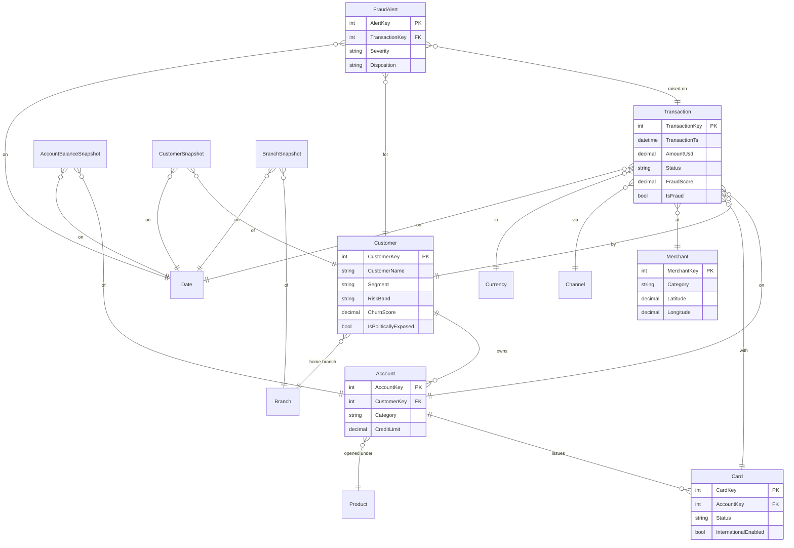

# Contoso Bank — Payments & Fraud Intelligence Ontology

A **Fabric IQ–style ontology**: a shared business vocabulary (entity types,
properties, relationships, rules) bound to physical Delta tables in a Lakehouse.
It grounds a **Fabric Data Agent**, which is published to **Copilot Studio** and
consumed by a **Rayfin** data app.

> **Why an ontology and not "just tables"?** The ontology is the trusted semantic
> layer. It gives the Data Agent business meaning ("a *high-value transaction* is
> `AmountUsd > 3000`", "*fraud rate* = share where `IsFraud = true`"), governed
> relationships for joins, and rules for risk — so natural-language questions map
> to correct, governed queries instead of the LLM guessing.

## At a glance

| | Count |
|---|---|
| Entity types | **14** (8 dimensions + 6 facts) |
| Relationships (bindings) | **20** |
| Business rules | **6** |
| Sample rows generated | ~62,000 across 14 tables |
| Real-time element | `fact_transaction` + `fact_fraud_alert` — trailing 48h streams live |

## Entity-relationship diagram

## Entity catalog

### Dimensions

| Entity | Table | Grain | Key properties |
|---|---|---|---|
| **Customer** | `dim_customer` | one per customer | Segment, Country, CreditScore, RiskBand, ChurnScore, IsPoliticallyExposed |
| **Account** | `dim_account` | one per account | Category, CurrencyCode, Status, CreditLimit |
| **Card** | `dim_card` | one per card | CardType, Network, Status, InternationalEnabled |
| **Merchant** | `dim_merchant` | one per merchant | Category (MCC), Country, Lat/Lon, BaseRiskScore |
| **Channel** | `dim_channel` | one per channel | ChannelType, IsCardPresent, IsOnline, RiskWeight |
| **Product** | `dim_product` | one per product | Category, Segment, InterestRate |
| **Branch** | `dim_branch` | one per branch/ATM | BranchType, City, Country, Lat/Lon |
| **Currency** | `dim_currency` | one per currency | CurrencyCode, UsdRate |
| **Date** | `dim_date` | one per day | Year, Quarter, Month, IsWeekend |

### Facts

| Entity | Table | Grain | Key measures |
|---|---|---|---|
| **Transaction** | `fact_transaction` | one per payment/authorization | AmountUsd, FraudScore, IsFraud, Status (the **live stream**) |
| **FraudAlert** | `fact_fraud_alert` | one per alert | Severity, FraudScore, AmountUsd, Disposition |
| **AccountBalanceSnapshot** | `fact_account_balance_daily` | account × week | Balance, AvailableBalance, CreditUtilization |
| **CustomerSnapshot** | `fact_customer_daily_snapshot` | customer × week | TotalBalanceUsd, MtdSpendUsd, ChurnScore |
| **BranchSnapshot** | `fact_branch_daily_snapshot` | branch × day | TransactionVolume, TransactionValueUsd, FraudCasesCaught |

## Business rules (governance layer)

| Rule | Applies to | Expression | Severity |
|---|---|---|---|
| High-risk transaction | Transaction | `FraudScore >= 0.75` | High |
| Blocked-card decline | Transaction | `Card.Status = 'Blocked' AND Status <> 'Declined'` | Critical |
| Dormant-account activity | Transaction | `Account.Status = 'Dormant' AND Amount > 0` | Critical |
| Credit-limit breach | Balance | `CreditUtilization > 1.0` | High |
| Open critical-alert SLA | FraudAlert | `Severity = 'Critical' AND Status = 'Open'` | High |
| PEP large wire (AML) | Transaction | `Customer.IsPoliticallyExposed AND Type='Wire' AND AmountUsd>10000` | Critical |

## How "binding" works here

1. **Physical binding** — every entity type names its Delta `table` and `key`
   column (see `ontology.json → entityTypes[].binding`). The notebook
   `fabric/notebooks/01_build_lakehouse_tables.py` creates those tables.
2. **Relationship binding** — each relationship maps a foreign-key column on the
   "from" entity to the key column on the "to" entity (`ontology.json →
   relationships`). These become the model relationships in the semantic model.
3. **Semantic binding (KPIs)** — governed metrics live as DAX measures in
   `fabric/semantic-model/measures.dax` (e.g. `[Fraud Rate]`, `[Approval Rate]`,
   `[Total Transaction Value]`), so the agent and the app share one definition.
4. **Agent binding** — the Data Agent points at the semantic model + ontology;
   the glossary and rules above are mirrored into its AI instructions
   (`data-agent/DATA_AGENT_INSTRUCTIONS.md`).

See `../README.md` for the end-to-end build order.
